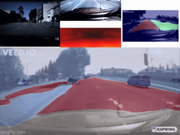

# Vigilant Driving 
 

# Requirements
- Requires [Pytorch](https://pytorch.org/) to run.
- Use tools.yml / requirement.txt to install the appropriate packages that you may need to install in your system.
```sh
   cd vigilant-driving
   python -m pip install -r requirements.txt
  ```

```sh
   cd vigilant-driving
   conda env create -f tools.yml
  ```




# Run
- Makes prediction using the device's camera 
  ```sh
   cd vigilant-driving/common
   python run.py -load camera 
  ```
- Make prediction using a .mp4 file 
  ```sh
   cd vigilant-driving/common
   python run.py -video insert_your_video_here.mp4 -load video  
  ```


# ARM64
- **REQUIRED** [Libtorch](https://pytorch.org/cppdocs/installing.html) | [OpenCV](https://docs.opencv.org/master/d7/d9f/tutorial_linux_install.html)
- Edit the CMakeLists file (set the correct directories) before executing.  
  
  ```sh
   cd vigilant-driving/arm64
   python models.py
   mkdir -p build && cd build
   cmake .. 
   make && ./main
  ```

# Directory Structure
------
    .
     ├── common             #  Main control for all models 
     ├── mobile             #  android app 
     ├── arm64              #  ARM64 support 
     ├── Segnet             #  Segmentation on lanes
     ├── Segnet_V2          #  Complete segmentation on the environment
     ├── Depth              #  Segmentation on lanes
     ├── Speed              #  Speed Prediction
     ├── Etc                #  Random Files, Images, Gifs


# Release 
- Available Models: ['disparitynet', 'segnet', 'ures', 'vidresnet', 'segnetv2']
- Please use the latest release to download models: 
    - alantess/vigilant-driving:main/{**latest_release**}
```python
import torch
repo = 'alantess/vigilant-driving:main/1.0.75'
model = torch.hub.load(repo, 'segnet', pretrained=True)
```
------

# Datasets
- [Segnet](https://bdd-data.berkeley.edu/)
- [Segnet_V2](https://github.com/commaai/comma10k)
- [Speed](https://github.com/commaai/speedchallenge/tree/master/data)
- [Depth](http://apolloscape.auto/stereo.html)


# To-Do
- [x] Fix memory allocation in android. 
- [ ] Re-train speed.  
- [ ] Complete trajectory analysis. 
- [x] Deploy models on ARM64 devices. 
- [ ] Optimize Models for ARM64 to allow CUDA instead of CPU. 


# License
----

MIT
