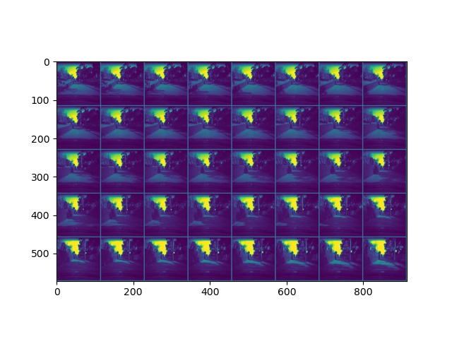
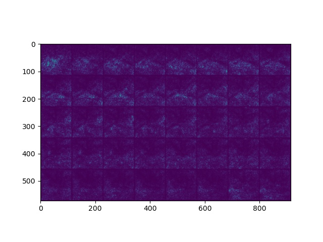

# Vigilant Driving 
 
- Deep Learning on the road.

# Requirements
- Requires [Pytorch](https://pytorch.org/) to run.
- Requires [Captum](https://captum.ai/) for model interpretability.

|   |   |
|:-:|:-:|
|   |   |
|   |   |


# SPEED
## Training Mode
- Use "-train" to set to training mode.
- Use "-epochs" to set the training epochs. Default is set to 1.

  ```sh
   cd vigilant-driving/speed
   mkdir models
   python main.py -train True -epochs 1000
  ```

## Important notes
- For first time user please comment out the code below until a model has been saved. You cannot load a model that doesn't exist. Can be found in the train function.
```python
# model.load()
```
- In order to save the model uncomment the code below in the train function. 
```python
model.save()
```
- Downloading the dataset may be better than using links. If done, please set the directories of the videos and text file in the code.


# ARM64
- **REQUIRED** [Libtorch](https://pytorch.org/cppdocs/installing.html) | [OpenCV](https://docs.opencv.org/master/d7/d9f/tutorial_linux_install.html)
- Edit the CMakeLists file (set the correct directories) before executing.  
  
  ```sh
   cd vigilant-driving/arm64
   mkdir -p build && cd build
   cmake .. 
   make && ./main
  ```

# Directory Structure
------
    .
     ├── mobile             #  android app 
     ├── arm64              #  ARM64 support 
     ├── gui                #  Qt GUI 
     ├── Segnet             #  Segmentation on lanes
     ├── Segnet_V2          #  Complete segmentation on the environment
     ├── Depth              #  Segmentation on lanes
     ├── Speed              #  Speed Prediction
     ├── Etc                #  Random Files, Images, Gifs


# Release 
- Available Models: ['disparitynet', 'segnet', 'ures', 'vidresnet', 'segnetv2']
- Please use the latest release to download models: 
    - alantess/vigilant-driving:main/{**latest_release**}
```python
import torch
repo = 'alantess/vigilant-driving:main/1.0.72'
model = torch.hub.load(repo, 'segnet', pretrained=True)
```
------

# Datasets
- [Segnet](https://bdd-data.berkeley.edu/)
- [Segnet_V2](https://github.com/commaai/comma10k)
- [Speed](https://github.com/commaai/speedchallenge/tree/master/data)
- [Depth](http://apolloscape.auto/stereo.html)


# To-Do
- [ ] Fix memory allocation in android 
- [ ] Complete trajectory analysis. 
- [ ] Deploy models on arm64 devices. 


# License
----

MIT
